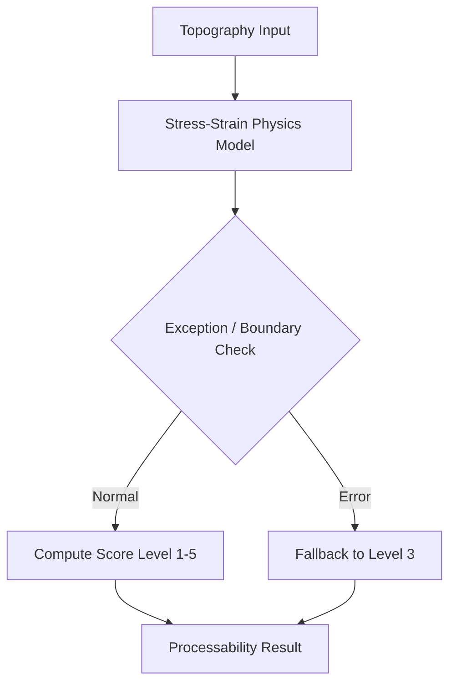

# 필요 가공성 수준 판별 (SG_proj_011)

## 1. 개요
3D 굴곡률과 재질 강성 데이터를 기반으로 고분자의 물리적 한계 및 유연성 요구 레벨을 정량적으로 판별하는 모듈입니다.

## 2. 시스템 아키텍처

## 3. 기술 스택
- Backend: FastAPI, Pydantic
- Logic: Custom Physics Rules

## 4. 참조 문서
- ADR-0001

---
*Updated by System: 2026-06-29 (Resolved 260627 Analysis Report priority issues)*
## 최신 업데이트 내역 (2026-07-05)
- [CI/CD]: 통합 E2E 테스트 검사 통과 및 전체 모듈 연동 보고서 발간 완료.
- [Pydantic 도메인 정밀화]: curvature_radius 에 대한 검증 조건에 3D 물리 연산 한계(0.01mm) 제약을 일치시켜 예외 안정성을 제고함.
- [loguru 로깅 통합]: uvicorn 로깅 대신 loguru를 적용하여 가공성 판정 연산 및 dynamic fallback 발생 이력을 상세 로깅하도록 개편함.
