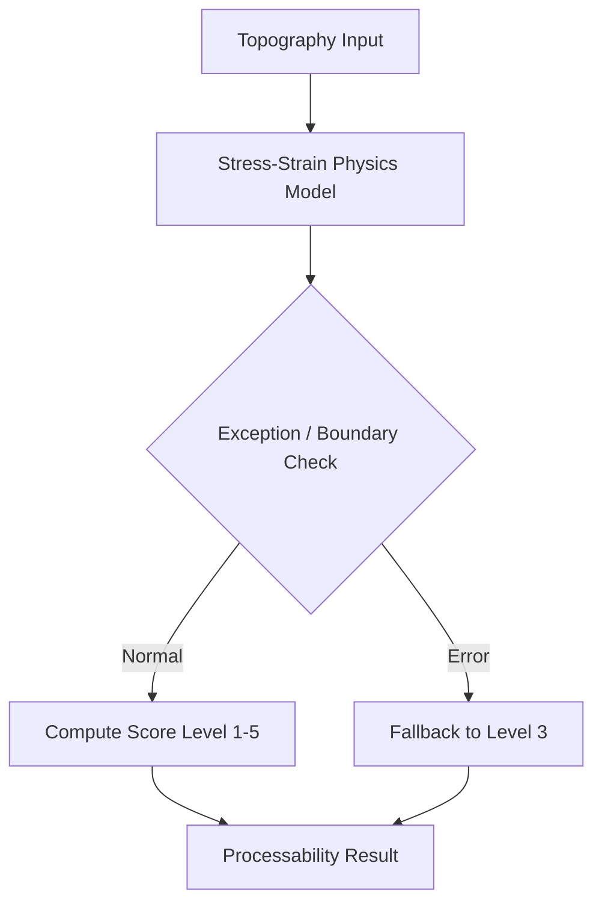

# 필요 가공성 수준 판별 (SG_proj_011)

## 1. 개요
3D 굴곡률과 재질 강성 데이터를 기반으로 고분자의 물리적 한계 및 유연성 요구 레벨을 정량적으로 판별하는 모듈입니다.

## 2. 시스템 아키텍처

## 3. 기술 스택
- Backend: FastAPI, Pydantic
- Logic: Custom Physics Rules

## 4. 참조 문서
- ADR-0001

---
*Last Updated: 2026-07-19 (Hybrid Environment & MSA Integration)*
